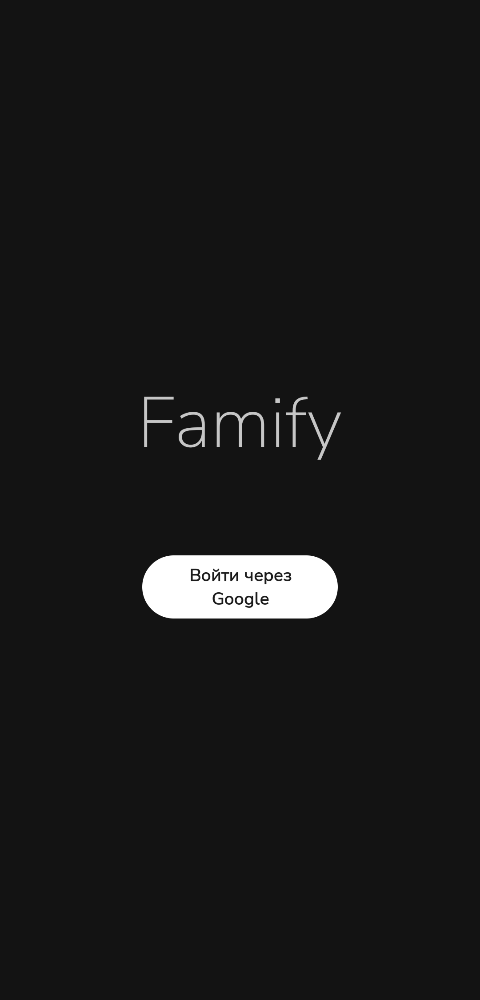

# Famify 🛒

**Семейный список покупок** — приложение для совместного ведения списка покупок с родными или друзьями в реальном времени.

## 📌 Возможности
- 🔐 Авторизация через Google
- 👨‍👩‍👧‍👦 Создание/присоединение к семейным группам
- 🛍️ Добавление, редактирование и удаление товаров
- ✅ Отметка купленных товаров
- 📱 Адаптивный Material Design 3 интерфейс
- 🔄 Синхронизация в реальном времени

## 🛠 Технологии
- **Язык**: Java
- **Backend**: Firebase (Auth, Firestore)
- **UI**: Material Components, RecyclerView, Fragments
- **Анимации**: ObjectAnimator, ValueAnimator

## 📱 Скриншоты

